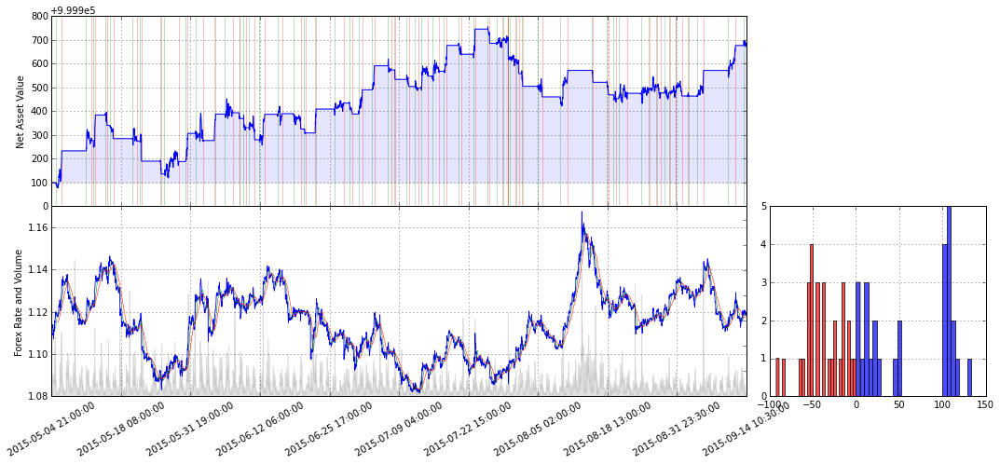
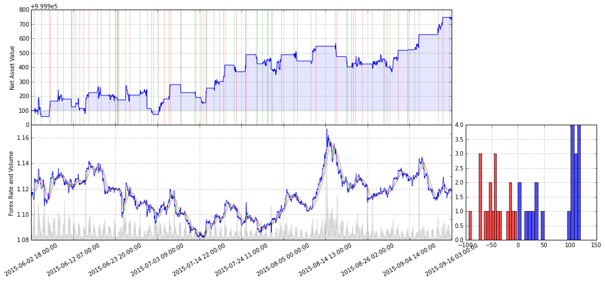
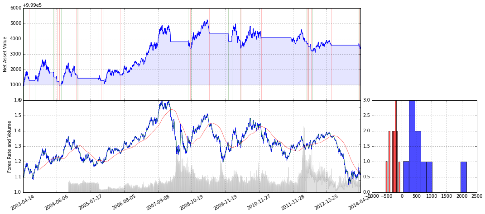

# OANDA-Forex

An OANDA Forex trading framework.

* Update naive backtest module (One Instrument). http://nbviewer.ipython.org/github/zedyang/OANDA-Forex/blob/master/notes_ts.ipynb

* Update some plotting methods.

###Toy .1: DMA(20,45) with Take_Profit/Stop_Loss on {EUR/USD; M30}

###Toy .2: DMA(12,25) with Take_Profit/Stop_Loss on {EUR/USD; H1}

###Toy .3: Trending DMA_200(10) on {EUR/USD; D1}

